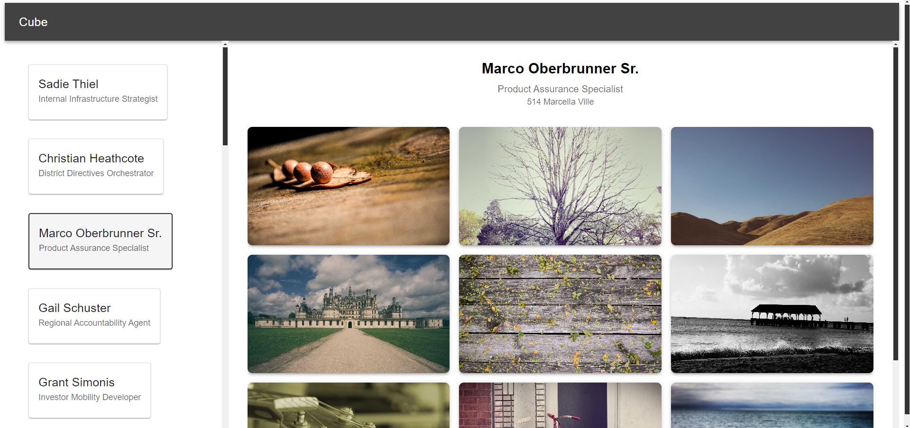
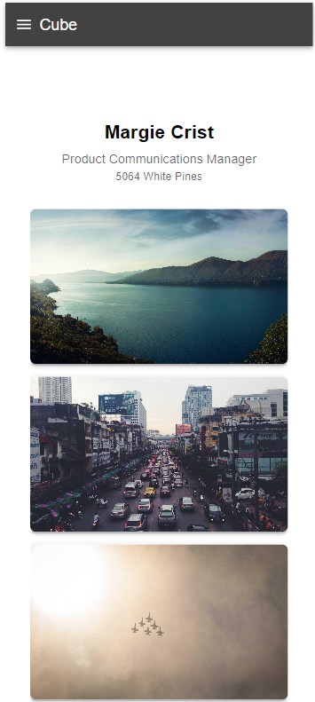
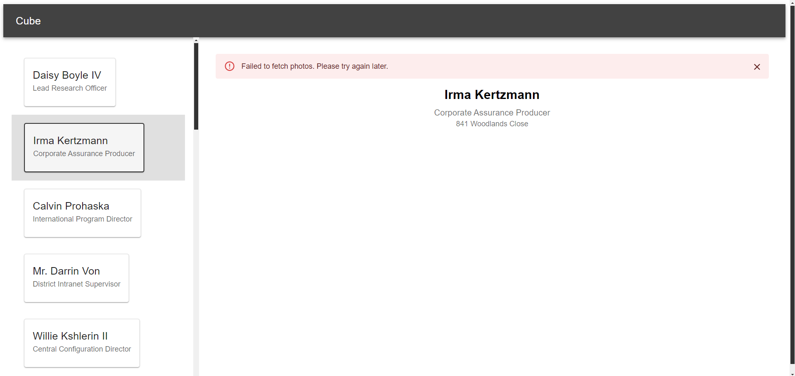

# Cube 🚀

 🌈

## Technologies Used

- React
- Material UI
- Zustand
- TypeScript
- CSS

## Features

- **Pagination of Customers:** Only the customers visible on the screen are loaded, improving performance and reducing initial load time.
- **Lazy Loading of Images:** Images are loaded only when they are about to become visible in the viewport, providing a smoother user experience and conserving bandwidth.
- **Image Refresh:** Images refresh every 10 seconds, keeping the content dynamic and engaging.
- **Responsive UI:** The user interface adapts to different screen sizes, ensuring a consistent and optimal experience on both desktop and mobile devices.
- **Smooth UX on Mobile:** The application provides a seamless and intuitive user experience on mobile devices, with a dedicated mobile layout.
- **Lorem Picsum API:** Utilizes the Lorem Picsum API to fetch random images, adding visual interest and variety.

## Screenshots

### Main Page

### Mobile View

| Customers List | Customer Details |
|--------------|-------------|
|  |  |

### Error Page (Custom Alert)

## How to Run

1. Clone the repository: `git clone https://github.com/FadeHack/cube`
2. Navigate to the project directory: `cd cube`
3. Install dependencies: `npm install`
4. Start the development server: `npm start`
5. Access the application in your browser: `http://localhost:3000`
